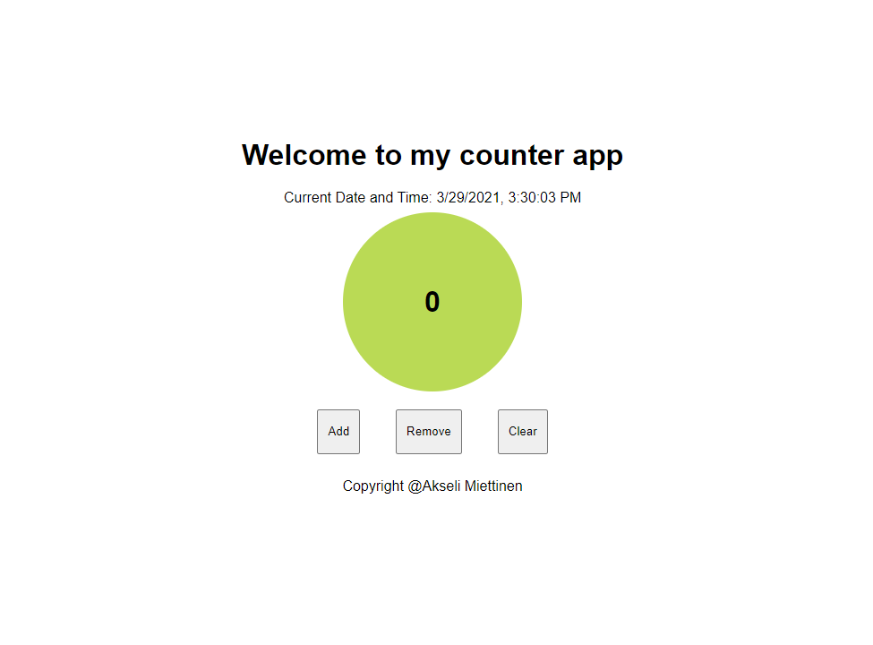

# Counter app creqted with React

School exercise for React.js
When you press add, it adds one to counter. Remove removes 1 (until 0). 0, oddd and even numbers have their own color.
Clear sets counter to 0.

Format: .png 
